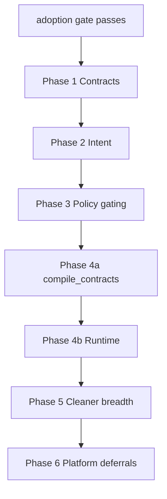

# Future Architecture MVP Roadmap (Public expansion — gated)

**Status:** Public README / marketing expansion only — **not** internal backbone lab builds.

Active internal execution: [backbone-lab.md](backbone-lab.md) (build + test primitives behind
`CM_EXPERIMENTAL=1`). Wedge shipping: [v1-boundary.md](v1-boundary.md).

## Gate requirement (public claims only)

Do not expand public product claims until [adoption-gate.md](adoption-gate.md) records all of:

- Named external asker (person, team, or paying org)
- Verbatim quote asking for metrics, gated contracts, runtime, or policy expansion
- Link to GitHub issue, email thread, or customer ticket

Fails the gate: internal momentum, "the architecture is clear," or "we'll need this eventually."

---

## Engineering principles (when gate passes)

1. **One path per concern** — traversal in `clearmetric.graph`, policy in `clearmetric.policy`, projection in `clearmetric.projection`, emission in `clearmetric.emitters`, build in `clearmetric.compiler`, lineage parse in `clearmetric.lineage` (build only).
2. **Delete, don't reroute** — no stub CLI formats, legacy wrappers, or compatibility shims.
3. **Loud errors only** — missing nodes, missing `compiled_sql`, missing identity on gated paths, policy eval errors → typed exceptions; never silent fallbacks.
4. **Security centralized** — `gate` is the sole consumer authorization entry; `evaluate_node` and `validate_security_floor` live inside `policy/` only.
5. **Production-ready simplicity** — minimal HTTP surface; only working emitters registered in CLI.
6. **Test where it matters** — MVP e2e, ground_truth parity, policy adversarial suite, security floor.

---

## North star (post-gate)

Architecture MVP = **core + Module A + Module B**, proven by one demo:

```mermaid
flowchart LR
  subgraph in [Inputs]
    dbt[dbt]
    sql[SQL]
    wh[warehouse JSON]
    intent[intent YAML]
  end
  subgraph core [Centralized core]
    adapters[adapters]
    compiler[compiler.pipeline]
    graph[graph.GraphView]
    policy[policy.evaluate_node gate floor]
    projection[projection.project_for_emit]
  end
  subgraph out [Outputs]
    json[graph.json]
    catalog[catalog.json]
    contracts[frontend-contract.json]
    impact[impact CLI]
    query[cm query serve]
  end
  in --> adapters --> compiler --> graph
  graph --> impact
  graph --> projection --> policy
  policy --> catalog
  policy --> contracts
  policy --> query
  compiler --> json
```

**First demo commands** (after gate + consolidation):

```bash
cm scan
cm compile --format json > graph.json
cm compile --format catalog > catalog.json
cm compile --format frontend-contract --identity analyst > contracts.json
cm clean
cm impact column.fct_orders.net_revenue --upstream
cm query --identity analyst query:executive.revenue_by_month graph.json
cm serve --identity analyst graph.json
```

Same canonical IDs in graph, catalog, gated contract, impact traversal, and query execution.

---

## Centralized public surfaces (target end-state)

| Module | Owns | Must NOT |
|--------|------|----------|
| `clearmetric.graph` | `GraphView`, traverse, selector, impact trace, traversal render | Parse SQL, evaluate policy |
| `clearmetric.lineage` | `build_catalog_artifact_from_project`, sqlglot derivation | Traversal, traversal render, OpenLineage serialization |
| `clearmetric.policy` | `evaluate_node`, `validate_security_floor`, `load_rules` | Emit formats, traverse graph |
| `clearmetric.projection` | `project_catalog_assets`, `project_for_emit`, `project_consumer_catalog` | Policy rule parsing |
| `clearmetric.emitters` | `emit_compile`, `emit_impact`, target serialization | Policy logic beyond calling `gate` |
| `clearmetric.compiler` | `build_graph`, `compile`, `check_graph`, `enforce_graph`, `clean`, `impact` | SQL parsing |
| `clearmetric.runtime` | `execute_query`, `serve` | Ungated execution |

---

## Gated work items

| Item | Phase | Notes |
|------|-------|-------|
| Intent adapter as product surface | 2 | Batch validation errors |
| Metric/query contracts | 1 | `core/contracts.py`, `compiler/contracts.py` |
| `compile_contracts` | 4a | Loud `CompilerError` on failure |
| `frontend-contract` emitter | 4a | Full contract schema |
| `consumer-catalog` | 3 | Identity required; admin `catalog` unchanged |
| `cm query` / `cm serve` | 4b | Only after 4a; identity + `gate` required |
| Runtime policy gate | 4b | Denied → 403; never ungated |
| Graph query API | 5 | Read-only over `GraphView` |
| User-defined checks | 5 | Declarative YAML, same check engine |
| Richer node model | 2+ | owner, domain, lifecycle, provenance |
| RLS/masking policy expansion | 3 | `filter` decision for RLS rules |
| Security floor overrides | 3 | Recorded, expiring overrides only |
| Cleaner breadth | 5 | completeness, hygiene, smart duplicate detection |
| `ai-context` emitter | 5 | Policy-gated; no stub registration |
| Docs emitter | 6 | Markdown from graph slice |
| Live warehouse connector | 6 | Metadata + validation + runtime target |
| Policy compiler | 6 | Native RLS / OPA deployment |
| clearmetric-cloud | — | Paid tier; separate repo |

---

## Post-gate execution sequence



See [backbone-v2-roadmap.md](backbone-v2-roadmap.md) for phase detail, error matrix, and adversarial policy test requirements.

---

## Testing strategy (post-gate)

| Area | Test | Gate |
|------|------|------|
| Consolidation | `ground_truth.py` related_ids parity | Must match pre-move baselines |
| Boundaries | `test_repository_boundaries.py` | No cross-module leaks |
| Security | `test_adversarial.py`, `test_security_floor.py` | Deny/mask/filter/RLS; serve/query gated |
| MVP thesis | `test_mvp_demo.py` | Full subprocess demo path |
| Wedge regression | `test_wedge_e2e.py` | Unchanged wedge commands still green |
| Contracts | `test_contracts.py` | compiled_sql required |
| Resolver | oracle + adversarial fixtures | limitations.md stays honest |

---

## Explicit deferrals (even after gate)

- Full usage analytics from query logs
- Catalog UI, dashboard builder, approvals workflow
- Universal native policy enforcement claims (honest three modes only)

Architecture placeholders remain valid in aspects YAML:

```yaml
security: { classification: internal, policy_refs: [] }
ai:       { allowed: true, notes: [] }
usage:    { tracking_enabled: false }
```

---

## Success criteria (post-gate Architecture MVP)

1. First demo script runs end-to-end on committed fixtures in CI.
2. Same canonical ID in graph, catalog, contract, impact, and query.
3. Derived facts carry derivation state; gaps are findings, not guesses.
4. Security floor holds; policy fails closed.
5. Runtime and gated emitters require identity and call `gate`.
6. Wedge commands and admin catalog remain unchanged for non-gated users.
